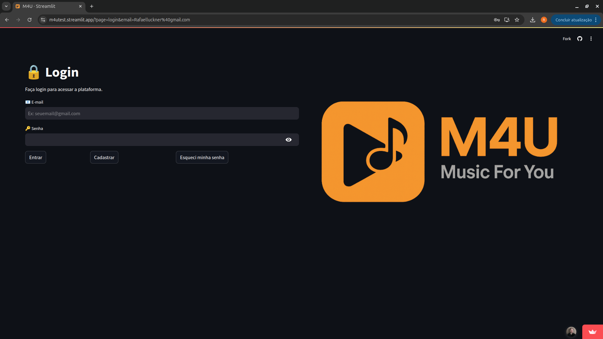
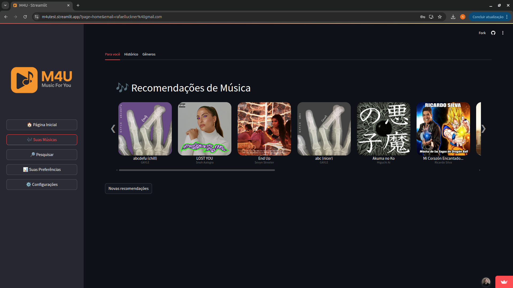
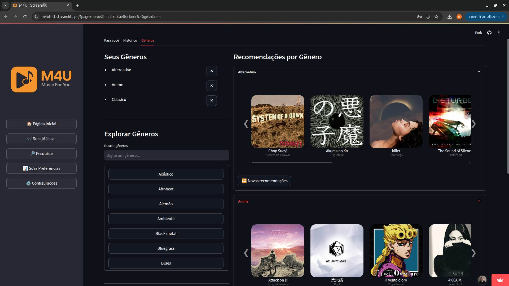
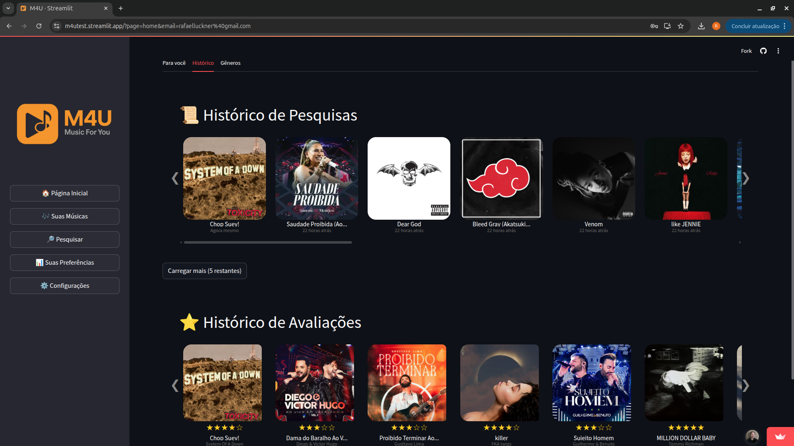
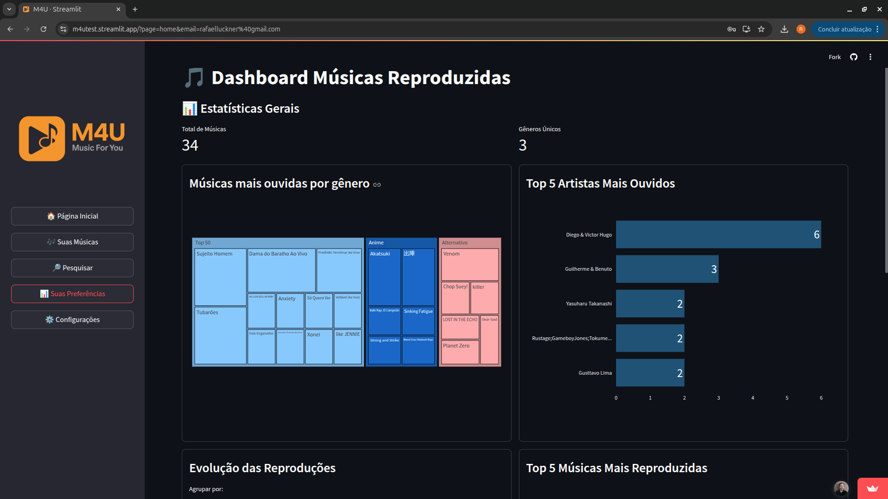

# M4U - Music For You
## Visão Geral
M4U - Music For You é uma aplicação web desenvolvida com Streamlit que utiliza técnicas de Machine Learning para oferecer um sistema de recomendação de músicas personalizado. O projeto analisa o histórico de interações, preferências de gênero e artistas dos usuários, além de recomendar faixas com base em conteúdo, sugerindo músicas alinhadas aos seus gostos a partir de dados públicos.

## Objetivo
- Criar um sistema de recomendação que combine histórico de escuta, preferências de usuários e análise de conteúdo para sugerir músicas personalizadas.
- Fornecer uma interface visual intuitiva para exibir estatísticas de escuta e recomendações de músicas.

## Tecnologias
- **Python**: Linguagem principal de desenvolvimento.
- **Pandas**: Manipulação e análise de dados.
- **Scikit-Learn**: Modelos de Machine Learning para recomendações.
- **Streamlit**: Interface web interativa.
- **MongoDB**: Armazenamento e gestão de dados dos usuários.


## Telas e Componentes
- **Tela de Login**: Interface com campos para e-mail e senha, estilizada com o logotipo M4U, incluindo opções de cadastro e recuperação de senha.  
    

- **Tela de Boas-Vindas**: Apresenta um texto introdutório sobre o sistema de recomendações.  
    

- **Tela de Recomendações**: Mostra um carrossel de músicas sugeridas com capas de álbuns, filtradas por gênero.  
    

- **Tela de Gêneros**: Exibe gêneros selecionados e recomendações por gênero em um carrossel.  
    

- **Tela de Histórico de Pesquisas**: Exibe todas as músicas pesquisadas e avaliações realizadas.

    

- **Tela Dashboard**: Exibe gráficos e estatísticas gerais sobre seu histórico.  
    

- **Tela do Reprodutor do YouTube**: Apresenta uma janela de reprodução com a música atual diretamente do YouTube, com controle de avaliação e exibição das músicas mais ouvidas no Brasil e no mundo. Inclui redirecionamento para Deezer e Spotify, além de um carrossel de recomendações baseado em conteúdo na parte inferior, permitindo ouvir músicas personalizadas sem interrupção.  


## Como as Recomendações São Feitas

O sistema de recomendações deste projeto utiliza um algoritmo baseado em **K-Nearest Neighbors (KNN)** combinado com técnicas de aprendizado de máquina para sugerir músicas personalizadas aos usuários. Abaixo está uma visão geral de como o processo funciona:

1. **Coleta e Pré-processamento de Dados**:

   - Os dados são extraídos de um dataset armazenado em `data/data.csv`, que contém informações como nome da música, artistas, gênero e URLs de capas. Além disso, são consideradas avaliações e preferências dos usuários salvas no MongoDB.
   - As features relevantes (ex.: características de áudio, popularidade ou similaridade de gênero) são extraídas e normalizadas usando o `StandardScaler` para garantir consistência nos cálculos.

2. **Treinamento do Modelo KNN**:

   - O modelo KNN é treinado com o conjunto de dados pré-processado, calculando a similaridade entre músicas com base em uma métrica de distância (como cosseno). O número de vizinhos é ajustado dinamicamente para refletir o tamanho do dataset ou um limite fixo de recomendações.
   - O modelo é ajustado para considerar todas as amostras disponíveis, permitindo recomendações precisas tanto para músicas do mesmo gênero quanto para gêneros variados.

3. **Geração de Recomendações**:

   - Quando um usuário busca uma música (ex.: "Bohemian Rhapsody - Queen"), o sistema identifica o índice correspondente no dataset.
   - O KNN busca os vizinhos mais próximos da música de entrada, calculando a similaridade com base nas features normalizadas. O número de recomendações é limitado (por padrão, 10 músicas).
   - Se o usuário optar por "Mesmo gênero" (via botão de alternância na interface), o sistema filtra as recomendações para músicas do mesmo gênero da entrada, usando os gêneros favoritos salvos no MongoDB. Para "Gêneros variados", recomendações são geradas sem essa restrição, explorando uma diversidade maior.

4. **Personalização e Exibição**:

   - As recomendações são ordenadas pela similaridade e exibidas em um carrossel na interface Streamlit, com capas de álbuns carregadas do campo `cover_url` do dataset ou obtidas via API do Spotify (com cache para otimização).
   - A integração com MongoDB permite salvar histórico e avaliações, refinando futuras recomendações com base nas preferências do usuário.

Esse processo combina eficiência computacional com personalização, oferecendo uma experiência interativa e adaptável para os usuários do sistema.


## Estrutura de Pastas

```
/m4u-streamlit
    /docs                           # Documentação do projeto
        - TAP.docx
        - Definicao_Projeto.docx

    /src                  # Código fonte do projeto
        /ml                     # Modelos de Machine Learning
            - modelo_recomendacao.py  # Algoritmo de recomendação
        /utils                  # Funções auxiliares
            - helpers.py        # Pré-processamento de dados

    /data                 # Dados para treinamento
        - data.csv            # Dataset base (Spotify Tracks)

    /web                  # Interface web (Streamlit)
        - app.py
        /assets           # Arquivos estáticos
            - musica.png
        /pages            # Páginas do aplicativo
            - home.py
            - recomendacoes.py

    requirements.txt      # Dependências do projeto


```